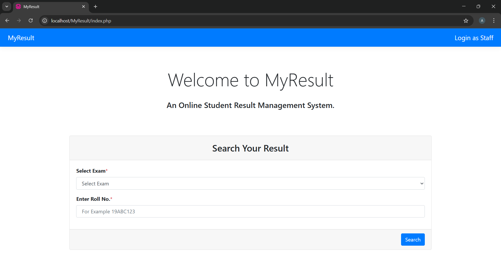
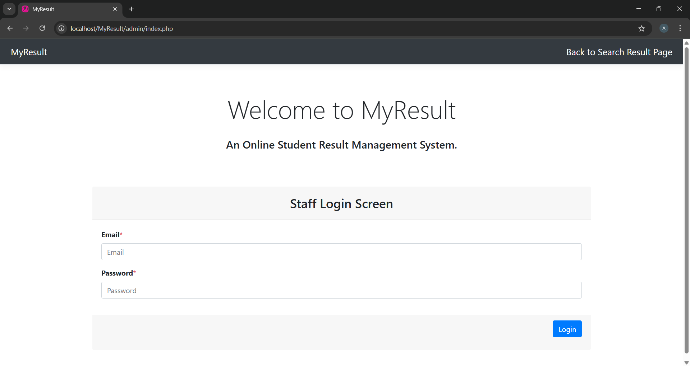

# MyResult

## Table of Contents
- [Introduction](#introduction)
- [Features](#features)
- [Requirements](#requirements)
- [Installation](#installation)
- [Usage](#usage)
- [Contributing](#contributing)
- [License](#license)
- [Contact](#contact)

## Introduction
MyResult is an online result management system designed to provide worldwide access to examination results. This web application allows multiple students or candidates to view their results simultaneously, eliminating the need to wait for results to be posted on notice boards at organizations, schools, or colleges. Administrators and authorized staff members have the privileges to add, modify, and delete results and student records. Additionally, administrators can manage staff members, including adding, modifying, deleting, and assigning roles to them. Students can select their exam and enter their specific ID to view their results.

## Features
- Global access to examination results
- Simultaneous result viewing for multiple users
- CRUD operations (Create, Read, Update, Delete) for results and student records
- Role-based access control for administrators and staff
- Responsive design using Bootstrap

## Requirements
- PHP 7.4 or higher
- MySQL 5.7 or higher
- Web server (e.g., Apache, Nginx)
- Composer (for dependency management)

## Installation
1. **Clone the repository:**
    ```sh
    git clone https://github.com/AfshanAlamEngg/MyResult.git
    cd MyResult
    ```

2. **Place the clone folder in the www folder of wamp server**
    ```sh
    cd wamp or wamp64
    cd www
    ```

3. **Create a MySQL database:**
    ```sql
    CREATE DATABASE srms;
    ```

4. **Import the database schema to srsm using PhpMyAdmin panel of wamp server:**
    ```sh
    mysql -u username -p some_password < database/v1/srms.sql
    ```

5. **Configure the database connection:**
    Update the `srms.php` file with your database credentials.


6. **Start the wamp server, Then open your browser and navigate to:**
    ```
    http://localhost/MyResult
    ```

## Note: Final Result - End User Side
The homepage for end user would be similar to the below image


## Note: Final Result - Admin Side
The homepage for the admin side would be similar to the below image



## Usage
- **View results:** Students can select their exam and enter their specific ID to view their results.
- **Manage results:** Administrators and authorized staff can add, modify, and delete results.
- **Manage students:** Administrators and authorized staff can add, modify, and delete student records.
- **Manage staff:** Administrators can add, modify, delete staff members, and assign roles.

## Contributing
Contributions are welcome! Please fork the repository and submit a pull request with your changes. Ensure your code follows the project's coding standards and includes appropriate tests.

## License
This project is licensed under the MIT License. See the LICENSE file for more details.

## Contact
For any questions or suggestions, feel free to reach out:
- **Email:** afshanalamengg@gmail.com
- **GitHub:** [AfshanAlamEngg](https://github.com/AfshanAlamEngg)
